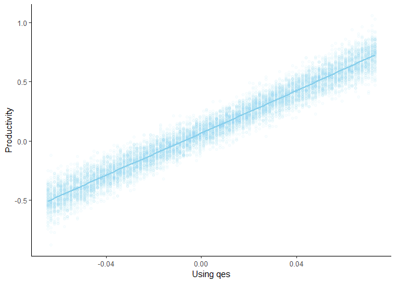

QuickCoefPlot
================
Sondre U. Solstad

Easy Effect Size Plots with options in R
========================================

QuickEffectSize is an easy interface for effect size plots in R. Using the Zelig package and ggplot2, it simulates and visualizes effect sizes of any zelig model.

By default the plot shows 100 simulations for 100 values of the selected independent variable. These values are set to range from one standard deviation above to one standard deviation below the mean.

Written by Sondre U. Solstad, Princeton University (<ssolstad@princeton.edu>). Send me an email if you find this package useful or want to suggest an improvement or feature.

Installation instructions:

``` r
library(devtools)
install_github("sondreus/QuickEffectSize")
```

Example:
--------

``` r
library(QuickEffectSize)
library(Zelig)

dat <- data.frame(y = rnorm(100), x1 = rnorm(100), x2 = rnorm(100))
dat$x3 <- dat$y + rnorm(100)
qes(zelig(y ~ x1 + x2 + x3, data = dat, model = "normal", cite = FALSE), 
    iv.var = "x3", xlab = "Using qes", ylab = "Productivity", progress = FALSE)
```



Arguments:
----------

-   **zelig.model** - Fitted zelig model
-   **iv.var** - Independent variable. sim.n Number of simulations for each value of iv.var simulated. Defaults to 100.
-   **range.n** - Number of different values of iv.var to simulate. Defaults to 100.
-   **custom.range** - Vector of two values specifying a range within which different values of iv.var should be simulated. (Optional)
-   **return.pdata** - Should the data to construct the plot be returned instead of the plot itself? Defaults to FALSE.
-   **progress** - Should the data to construct the plot be returned instead of the plot itself? Defaults to FALSE. Should progress be reported? (defaults to TRUE)
-   **coord.ylim** - Sets limits on what part of the x.axis to display through ggplots coord\_cartesian() function. (Optional)
-   **set.covar** - Option to specify values of other predictors in simulations. (Optional)

References:
-----------

Zelig: R Core Team. 2008. normal: Normal Regression for Continuous Dependent Variables in Christine Choirat, Christopher Gandrud, James Honaker, Kosuke Imai, Gary King, and Olivia Lau, "Zelig: Everyone's Statistical Software," <http://zeligproject.org/>

H. Wickham. ggplot2: Elegant Graphics for Data Analysis. Springer-Verlag New York, 2016.
